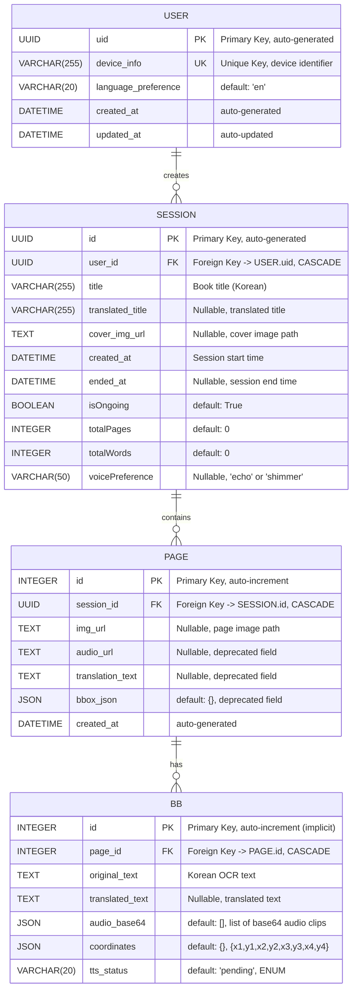

# StoryBridge Database ER Diagram

## Entity Relationship Diagram



## Database Schema Details

### 1. USER Table

**Table Name:** `apis_user`

| Column | Type | Constraints | Description |
|--------|------|-------------|-------------|
| uid | UUID | **PK** | Primary Key, auto-generated UUID |
| device_info | VARCHAR(255) | **UK, NOT NULL** | Unique device identifier |
| language_preference | VARCHAR(20) | NOT NULL, DEFAULT 'en' | User's target language |
| created_at | DATETIME | NOT NULL | Account creation timestamp |
| updated_at | DATETIME | NOT NULL, AUTO | Last update timestamp |

**Indexes:**
- PRIMARY KEY: `uid`
- UNIQUE KEY: `device_info`

---

### 2. SESSION Table

**Table Name:** `apis_session`

| Column | Type | Constraints | Description |
|--------|------|-------------|-------------|
| id | UUID | **PK** | Primary Key, auto-generated UUID |
| user_id | UUID | **FK → USER.uid, NOT NULL, CASCADE** | Foreign Key to User |
| title | VARCHAR(255) | NOT NULL | Book title (Korean) |
| translated_title | VARCHAR(255) | NULLABLE | Translated book title |
| cover_img_url | TEXT | NULLABLE | Cover image file path |
| created_at | DATETIME | NOT NULL | Session start time |
| ended_at | DATETIME | NULLABLE | Session end time |
| isOngoing | BOOLEAN | NOT NULL, DEFAULT TRUE | Session status flag |
| totalPages | INTEGER | NOT NULL, DEFAULT 0 | Total number of pages |
| totalWords | INTEGER | NOT NULL, DEFAULT 0 | Total words read |
| voicePreference | VARCHAR(50) | NULLABLE | Voice style ('echo'/'shimmer') |

**Indexes:**
- PRIMARY KEY: `id`
- FOREIGN KEY: `user_id` → `USER.uid`

**Relationships:**
- **Many-to-One**: SESSION → USER (via `user_id`)
- **One-to-Many**: SESSION → PAGE (reverse: `pages`)

---

### 3. PAGE Table

**Table Name:** `apis_page`

| Column | Type | Constraints | Description |
|--------|------|-------------|-------------|
| id | INTEGER | **PK, AUTO_INCREMENT** | Primary Key |
| session_id | UUID | **FK → SESSION.id, NOT NULL, CASCADE** | Foreign Key to Session |
| img_url | TEXT | NULLABLE | Page image file path |
| audio_url | TEXT | NULLABLE | Deprecated (use BB.audio_base64) |
| translation_text | TEXT | NULLABLE | Deprecated (use BB.translated_text) |
| bbox_json | JSON | DEFAULT {} | Deprecated (use BB table) |
| created_at | DATETIME | NOT NULL | Page creation timestamp |

**Indexes:**
- PRIMARY KEY: `id`
- FOREIGN KEY: `session_id` → `SESSION.id`

**Relationships:**
- **Many-to-One**: PAGE → SESSION (via `session_id`)
- **One-to-Many**: PAGE → BB (reverse: `bbs`)

**Notes:**
- `audio_url`, `translation_text`, `bbox_json` are deprecated fields
- All text/audio data is now stored in BB (Bounding Box) table

---

### 4. BB (Bounding Box) Table

**Table Name:** `apis_bb`

| Column | Type | Constraints | Description |
|--------|------|-------------|-------------|
| id | INTEGER | **PK, AUTO_INCREMENT** | Primary Key (implicit) |
| page_id | INTEGER | **FK → PAGE.id, NOT NULL, CASCADE** | Foreign Key to Page |
| original_text | TEXT | NOT NULL | Korean OCR text |
| translated_text | TEXT | NULLABLE | Translated text (English/Chinese) |
| audio_base64 | JSON | DEFAULT [] | List of base64-encoded audio clips |
| coordinates | JSON | DEFAULT {} | Bounding box coordinates {x1,y1,x2,y2,x3,y3,x4,y4} |
| tts_status | VARCHAR(20) | NOT NULL, DEFAULT 'pending' | TTS processing status |

**Indexes:**
- PRIMARY KEY: `id`
- FOREIGN KEY: `page_id` → `PAGE.id`

**Relationships:**
- **Many-to-One**: BB → PAGE (via `page_id`)

**Enumerations:**
- `tts_status`: ['pending', 'processing', 'ready', 'failed']

**JSON Field Schemas:**
- `coordinates`:
  ```json
  {
    "x1": float,
    "y1": float,
    "x2": float,
    "y2": float,
    "x3": float,
    "y3": float,
    "x4": float,
    "y4": float
  }
  ```
- `audio_base64`:
  ```json
  ["base64_string_1", "base64_string_2", ...]
  ```

---

## Relationship Summary

```
USER (1) ──────────── (N) SESSION
                        │
                        │
                        └── (1) ──────────── (N) PAGE
                                                │
                                                │
                                                └── (1) ──────────── (N) BB
```

### Cardinality Details

| Parent | Relationship | Child | Cardinality | ON DELETE |
|--------|--------------|-------|-------------|-----------|
| USER | creates | SESSION | 1:N | CASCADE |
| SESSION | contains | PAGE | 1:N | CASCADE |
| PAGE | has | BB | 1:N | CASCADE |

**Cascade Behavior:**
- Deleting a `USER` → Deletes all `SESSION` records → Deletes all `PAGE` records → Deletes all `BB` records
- Deleting a `SESSION` → Deletes all `PAGE` records → Deletes all `BB` records
- Deleting a `PAGE` → Deletes all `BB` records

---

## Key Constraints Summary

### Primary Keys (PK)
- `USER.uid` - UUID (auto-generated)
- `SESSION.id` - UUID (auto-generated)
- `PAGE.id` - INTEGER (auto-increment)
- `BB.id` - INTEGER (auto-increment, implicit)

### Unique Keys (UK)
- `USER.device_info` - Ensures one user per device

### Foreign Keys (FK)
- `SESSION.user_id` → `USER.uid` (CASCADE)
- `PAGE.session_id` → `SESSION.id` (CASCADE)
- `BB.page_id` → `PAGE.id` (CASCADE)

---

## Data Flow Example

```
1. User registers
   └─> USER record created with unique device_info

2. User starts reading session
   └─> SESSION record created (linked to USER)

3. User uploads page image
   └─> PAGE record created (linked to SESSION)
       └─> OCR detects text regions
           └─> Multiple BB records created (linked to PAGE)
               ├─> Each BB has original_text (Korean)
               ├─> Translation pipeline populates translated_text
               └─> TTS pipeline populates audio_base64

4. User ends session
   └─> SESSION.ended_at updated
   └─> SESSION.isOngoing set to False

5. User deletes session
   └─> SESSION deleted (CASCADE)
       └─> All PAGE records deleted
           └─> All BB records deleted
```

---

## Migration History

Based on migration files:
- `0001_initial.py` - Initial schema creation
- `0002_alter_session_voicepreference_alter_user_table.py` - Added voicePreference, changed User table name
- `0003_session_translated_title.py` - Added translated_title to Session
- `0004_session_cover_tts_female_session_cover_tts_male_and_more.py` - Added cover TTS fields (later removed)
- `0005_remove_session_cover_tts_female_and_more.py` - Removed cover TTS fields from Session

---

## Notes

- All UUID fields use `uuid.uuid4()` for generation
- All DATETIME fields use `timezone.now()` for defaults
- JSON fields are used for flexible storage of coordinates and audio data
- The `audio_url`, `translation_text`, and `bbox_json` fields in PAGE are deprecated and kept for backward compatibility
- Current architecture stores all text/audio data in BB (Bounding Box) table for granular control
